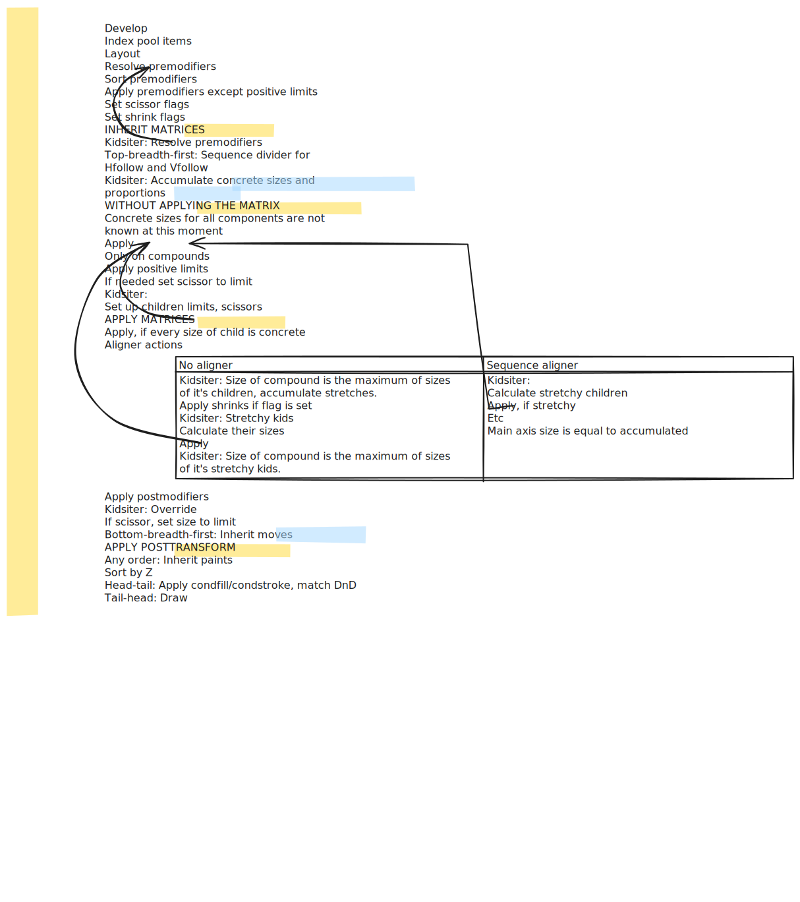

# Contraption
A real-time programmable vector graphics editor and GUI framework.

## Motivation
Go does not have a sane UI framework, and I need one for my heroic _endeavor_. Gio is [incomprehensible](https://gioui.org/doc/learn/get-started#creating-the-program). It is good from the "rendering technology" point of view (and soon I will use it as a browser backend), but its program interface is simply bad. You can't do a serious GUI application with it without an unlimited amount of time and sanity.

So I simply want a GUI framework that is [Apparatus](https://aprt.us) in form of code. Also it must be fast and be able to run in browser.

## Intro
See examples/sink/main.go

## Mode of operation
> In the following text, `wo` is the value of `contraption.World` that you got from calling `contraption.New`

Since not only Gio is bad but Go itself is sometimes bad, I had to implement a DSL.

There is a **compound** (`wo.Compound`) — a generic container inside of which **shapes** or **modifiers** can be placed. 

There are modifiers that specify the way its children are arranged. These modifiers are called aligners, and they are `Vfollow`, `Hfollow` or _nothing_, in which case the compound will use the stack layout.
There are also modifiers that change the geometry of children (`Halign`, `Valign`), stroke and fill (`Stroke`, `Strokewidth`, `Fill`), and so on.

Shapes are exactly what you think they are. Currently there aren't many, and the `Text` will be replaced by a Sequence-like element in the nearest future. 

**Sequences.** You can implement the `contraption.Sequence` interface to generate components from other sources. Currently it will get the **every element from the Sequence to generate the tree**. Receiving only those elements that could be drawn is currently only a planned feature.

**Contraption uses the function call mechanics for topological sorting of components to minimize copying. This means that sometimes you should use closures to place a component correctly in a tree. If you don't do this you will get an incorrect layout.** Will be obsolete in the next few weeks because I will return the pointer. Copying is simply too expensive according to profiling.

Anything that could be placed inside a compound has the type **Sorm**. Anything in the package `contraption` that returns a Sorm must be considered an **element** of Contraption.


## Layout model
Think [Subform Layout](https://subformapp.com/articles/why-not-flexbox/), but 100x dumber and there are actually no main and auxiliary axes are exposed to user (at least for now).

Positive size values function as pixels scaled by the applied transform. The `s` unit from Subform is the negative unit (-1, -2, -3 etc) in Contraption. Negative units are distributed between all children _recursively_, meaning that in
```
wo.Compound(
	wo.Vfollow(),
	wo.Rect(-1, -1),
	wo.Rect(-1, -1),
	wo.Compound(
		wo.Hfollow(),
		wo.Rect(-1, -1),
		wo.Rect(-1, -1),))
```
the -1 X and -1 Y in the deeper children is equal to the corresponding -1s of the children at the top.
Limit can _limit_ this behavior, thus the negative values in it break the recursion of calculations for the compound that contains it
Positive values for Limit are setting the maximum avaliable amount of units that is distributed for stretching. 
A maximum size for a compound can not be set. Limit applies only to the stretchy components, not the fixed ones.

## Cascade
For now, these things are cascaded from parent to children compounds:
- `wo.Transform` transforms
- fill and stroke paints
- stroke width
- font family
- font size (but i am not sure about this one)

## State
Contraption uses an unusual approach to state in components. Instead of storing an internal DOM and diffing it or updating it by signals, it stores only the latest history of the input events, the activator (focus object) stack and a tree from the previous update cycle. All the other states are external and are managed by the end user. Components can use regular expressions on events trace. It is enough for 80% of internal UI state, such as double-clicks, hover effects of *static components* and text field state. 

However, it is a compromise. For example, you can't do a button release effect on a scrollable pane (at least not yet, since there is no scrollable pane), because an object relies on its previous position to do it. I see using this system instead of VDOM like using screen-space techniques instead of path tracing.
## Events trace and regular expressions
- Regexps are matched left to right →
- **In a trace and in regexp syntax, the last event is the left-most ←**. `(*World).Events.Trace[0]` is also the latest event.
- Modifiers: `:in :out :before :after`
- `!` negates a symbol — match anything except this.
- `*` and `?` work like intended, `+` is not there for reasons I don't remember.
# Recipes
### Hotkey
From the Contraption itself:
```
if wo.Events.Match(`!Release(Ctrl)* Press(Ctrl)`) {
	if wo.Events.Match(`!Release(Shift)* Press(Shift)`) {
		if wo.Events.Match(`Press(I)`) {09
			wo.Goggles.on = !wo.Goggles.on
		}
	}
}
```
This will work too, but is order-dependent:
```
if wo.Events.Match(`Press(I) !Release(Ctrl)* !Release(Shift)* Press(Shift) !Release(Ctrl)* Press(Ctrl)`) {
	wo.Goggles.on = !wo.Goggles.on
}
```
# TBD
- Documentation, examples
- Scrolling
- Rotations
- Multiline text, sensible text interface
- Refine layout model so Transform makes sense

See also the comment at the beginning of `contraption.go`.

# Acknowledgements

The research was stolen from [tonsky](https://github.com/tonsky) from his articles about [his GUI framework](https://github.com/HumbleUI/HumbleUI)
- https://tonsky.me/blog/clojure-ui/
- https://tonsky.me/blog/humble-decomposition/
- https://tonsky.me/blog/humble-layout/
- https://tonsky.me/blog/humble-dx/
- https://tonsky.me/blog/humble-state/
- https://tonsky.me/blog/humble-signals/
- https://tonsky.me/blog/humble-vdom/
- https://tonsky.me/blog/humble-objects/
- https://tonsky.me/blog/humble-defcomp/

The idea of regexps for event maching is stolen from [Proton multitouch framework](http://vis.berkeley.edu/papers/proton/) and any other paper on using state machines in UI to match the user input.

Contraption was initially developed as the part of a larger project funded by [Foundation for Assistance to Small Innovative Enterprises UMNIK grant](https://fasie.ru/programs/programma-umnik/) № 18384ГУ/2023.

---

_A high-level description of the layout process I made to understand it more. I think it looks cool:_

